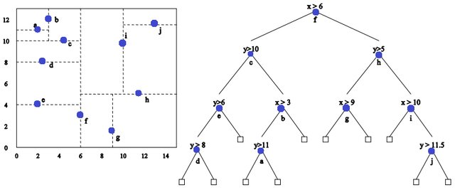

# Kd-Tree Implementation for Rapid Indexing of Protein Structures

## Example of a KD-Tree

*Each Circle Represents a Feature, and Each Area is Used to Limit the Histogram Calculations, (Left) The Division Cluster Areas (Right) the KD-Tree* 

*Figure from Nadhir Ben Halima*

## Context
A protein is a polymeric chain of amino acids. This chain has a great deal of freedom of orientation and folds to give a relatively compact form which determines its biological function in particular.

It is an important challenge for bioinformatics to quickly identify similarities (and differences) in structure between proteins.

## Implementation

The implemented kd-tree allows the search for the n-nearest neighbours of a 3D DNA structure in a protein bank in logarithmic time.

